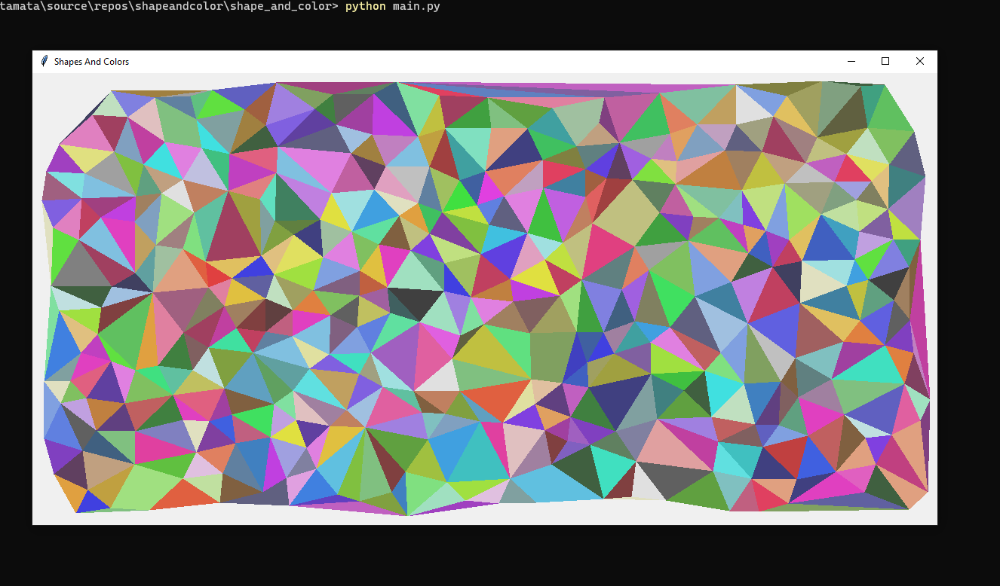

https://twitter.com/matamatajupiter/status/1417458235502587907  
前期のPythonの講義のポートフォリオとして作ったもの  
## Usage
・環境に入る(Windows cmd推奨)  
cd venv/Scripts  
activate.bat  
・実行ファイルへ移動  
cd shape_and_color  
・純粋なドロネー図を描画  
python main.py  
・increaseアルゴリズム  
python main.py increase  
・moveアルゴリズム  
python main.py move  
・上記で動く三角形の数を変更  
python main.py move 数字  
・環境を抜ける(Windows)  
deactivate.bat  
